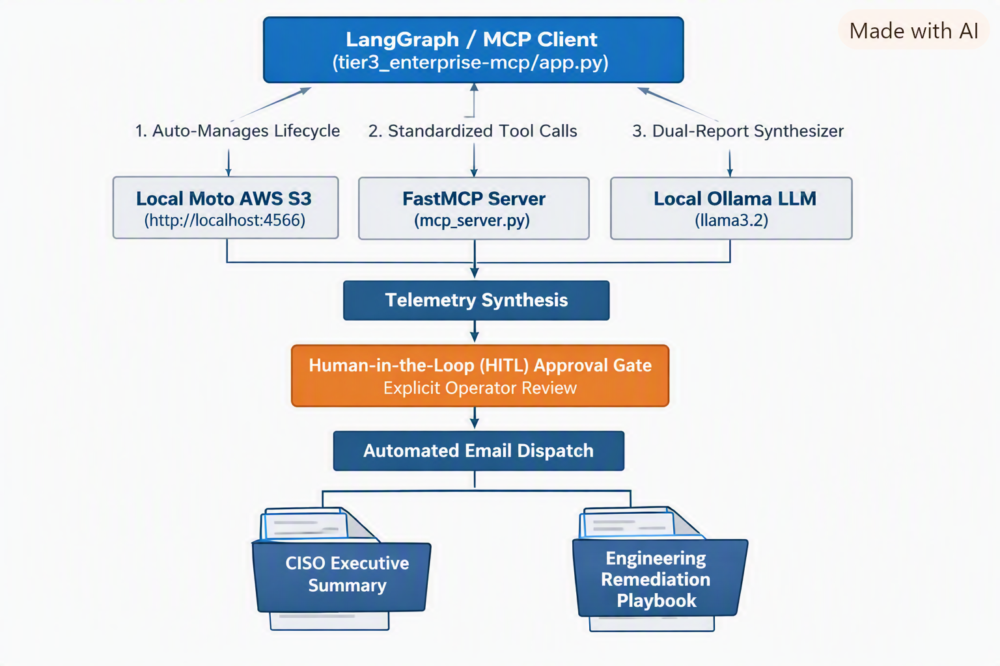
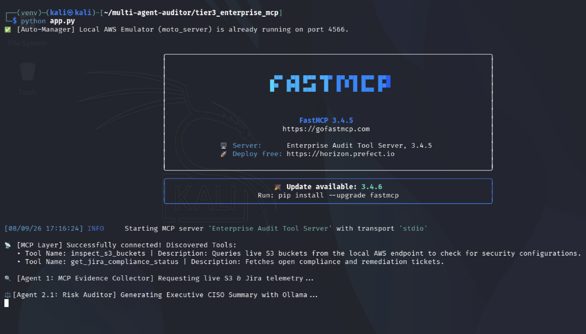
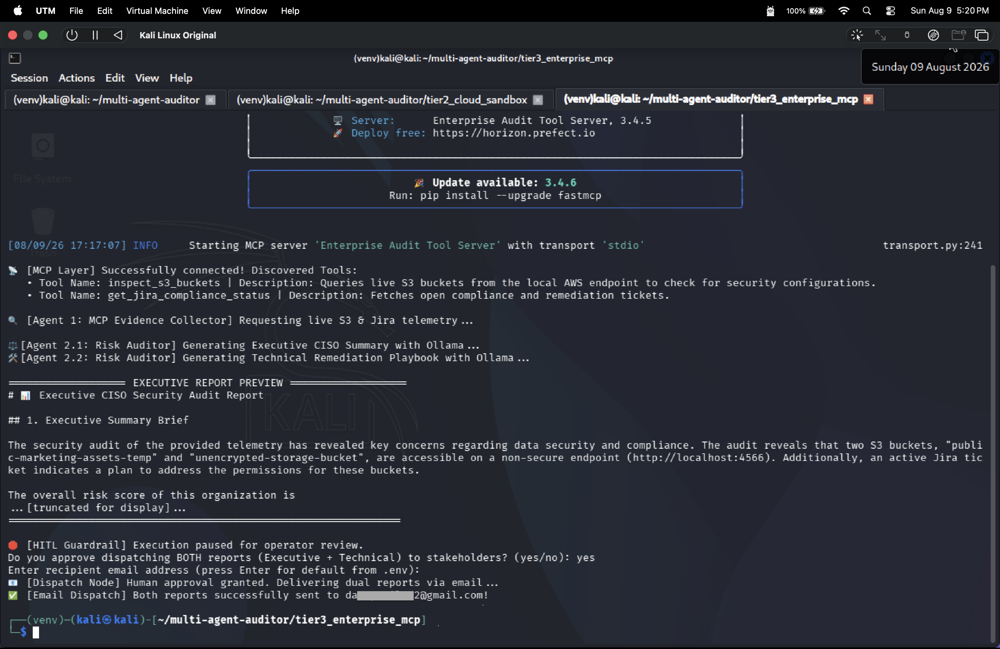
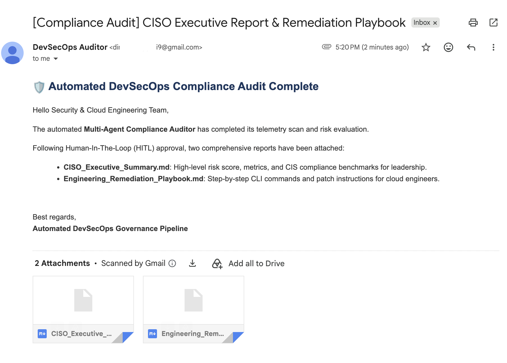

# Tier 3: Enterprise Multi-Agent Auditor (Model Context Protocol & HITL Dispatch)

This directory contains Tier 3 of the Multi-Agent DevSecOps Compliance Auditor project. In this module, local security auditing tools are decoupled into a standardized, production-ready Model Context Protocol (MCP) server architecture using FastMCP.

The pipeline features Human-in-the-Loop (HITL) safety governance and automated dual-document email dispatching for executive and engineering stakeholders.

---

## System Architecture
 
 

### Key Highlights
- Single-Command Execution: app.py automatically checks and manages the background lifecycle of the local AWS emulator (moto_server) on port 4566, starting and shutting it down cleanly.
- Self-Contained & Decoupled: The FastMCP server auto-seeds S3 buckets (public-marketing-assets-temp, unencrypted-storage-bucket) and Jira compliance issues (COMP-101) upon tool invocation.
- Dual-Document Audience Separation: Generates two distinct audit reports:
  * CISO Executive Summary: High-level risk scores (0-100), telemetry risk matrices, and CIS AWS Benchmark violations.
  * Engineering Remediation Playbook: Valid AWS CLI bash commands and step-by-step patch scripts for cloud engineers.
- Styled PDF Rendering: `pdf_report.py` converts each Markdown report into a branded, print-ready PDF (WeasyPrint) — cover band, a compliance score card pulled from the LLM's audit score, styled risk tables with severity badges, and dark-themed code blocks for CLI commands — instead of mailing raw `.md` text.
- Human-in-the-Loop (HITL) Safety Guardrail: Pauses execution until an operator explicitly approves dispatch in the terminal.
- 100% Local & Privacy-First: Operates offline on Kali Linux using local Ollama (llama3.2) and Moto emulation without API costs or telemetry exposure.

---

## Folder Structure
```
tier3_enterprise_mcp/
├── app.py                     # Main orchestrator (auto-moto manager, MCP client, HITL, Ollama)
├── mcp_server.py             # FastMCP server exposing S3 and Jira tools with auto-seeding
├── pdf_report.py             # Markdown → styled PDF renderer (WeasyPrint)
├── email_utils.py            # Multi-attachment MIME email dispatch module
├── README.md                 # Tier 3 project documentation
├── assets/                   # Execution screenshots and proof artifacts
│   ├── mcp_server_initiation.png
│   ├── hitl_operator_approval_prompt.png
│   └── smtp_email_received_proof.png
└── reports/                  # Generated audit report outputs
    ├── CISO_Executive_Summary.pdf
    └── Engineering_Remediation_Playbook.pdf
```
---

## Execution Screenshots & Evidence

### 1. FastMCP Server Discovery & Telemetry Collection
When `app.py` runs, it connects to `mcp_server.py` over standard I/O transport, discovers exposed FastMCP tools (`inspect_s3_buckets`, `get_jira_compliance_status`), and queries live telemetry.



---

### 2. Human-in-the-Loop (HITL) Approval Prompt
After local `llama3.2` synthesizes telemetry into dual Markdown reports, execution halts at an interactive security gate awaiting explicit operator confirmation before dispatching sensitive compliance findings.



---

### 3. SMTP Email Dispatch Verification
Upon entering `yes` at the HITL prompt, `pdf_report.py` renders both Markdown reports into styled PDFs and `email_utils.py` connects to the configured SMTP server and delivers an email with both PDFs as attachments.



---

## Prerequisites & Setup

### 1. Virtual Environment Setup
Ensure your Python virtual environment is activated and required libraries are installed:

```bash
source venv/bin/activate
pip install "mcp[cli]" fastmcp boto3 langchain-openai langgraph python-dotenv weasyprint markdown
```

`weasyprint` renders the PDFs and depends on system libraries (Pango, cairo, GDK-Pixbuf) for text/graphics layout — these are already present on this Kali image. On a fresh machine without them, install via `apt install libpango-1.0-0 libpangocairo-1.0-0 libcairo2 libgdk-pixbuf2.0-0` (Debian/Ubuntu) before `pip install weasyprint`.

### 2. Configure Credentials (.env)
Create a `.env` file at the **project root** (`~/multi-agent-auditor/.env`) — `email_utils.py` calls `load_dotenv()`, which walks up from the current working directory, so the root file is picked up whether you run `app.py` from `tier3_enterprise_mcp/` or elsewhere. The file is already gitignored.

```
SMTP_SERVER=smtp.gmail.com
SMTP_PORT=587
SENDER_EMAIL=your-email@gmail.com
SENDER_PASSWORD=your-16-char-app-password
DEFAULT_RECIPIENT=recipient-email@example.com
```

Note: For Gmail, use a 16-character Google App Password (with 2FA enabled). If `SENDER_EMAIL`/`SENDER_PASSWORD` are missing, `email_utils.py` logs an error and skips dispatch rather than failing the whole run.

---

## How to Run

Execute the complete end-to-end pipeline with a single command from inside `tier3_enterprise_mcp`:

```bash
python app.py
```

At the HITL prompt, enter `yes` to approve dispatch, then either press Enter to send to `DEFAULT_RECIPIENT` from `.env` or type a different recipient address. Entering `no` skips email dispatch entirely.
